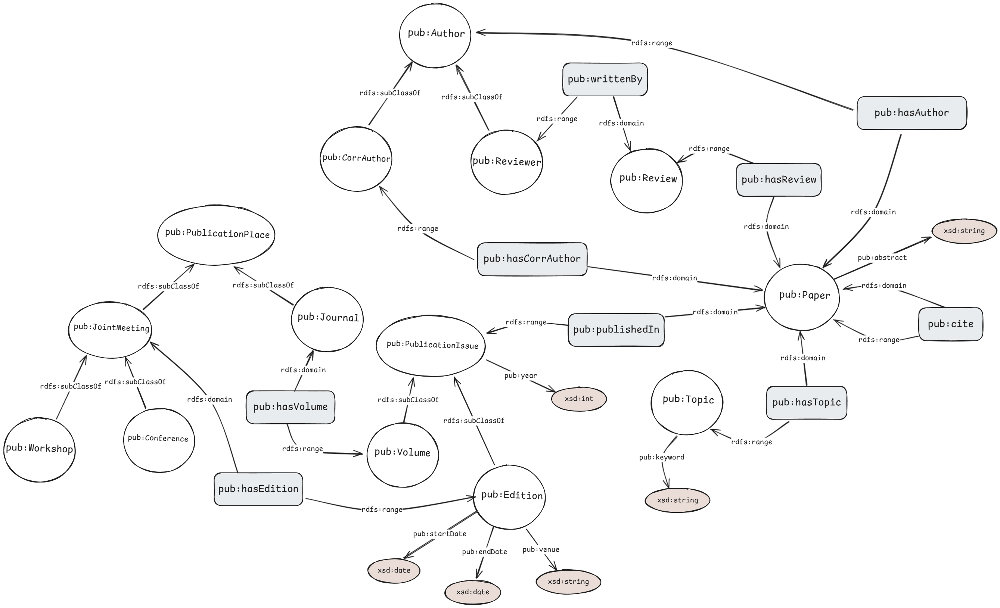

# SDM-2 - Knowledge Graphs

## Setup

Create python virtual environment

```bash
python -m venv .venv
```

Activate virtual environment

```bash
source .venv/bin/activate
```

Install dependencies

```bash
pip install -r requirements.txt
```

## Graph representation of the TBOX


